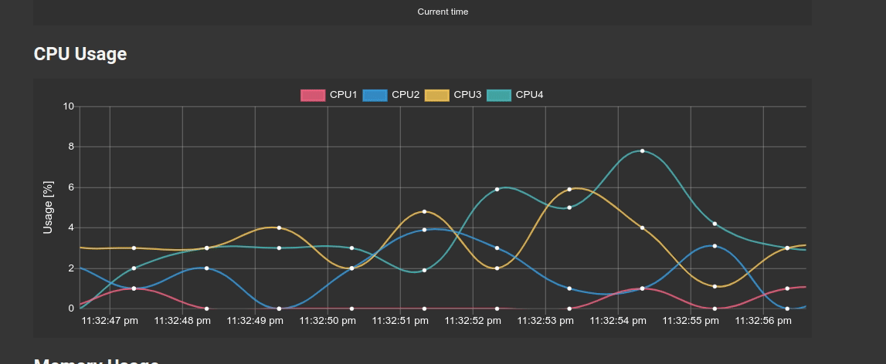

Raspi-StatMon
=============

Raspberry pi Status Monitor (StatMon) is simple web application that allow you to monitor statistic data such as CPU temperature and Usage of Raspberry pi on the graph.You can also add a graph to monitor the data obtained from the external sensor connected to the raspi.

See [here](https://git-ogawa.github.io/raspi-statmon/) for installation, usage and more details.

