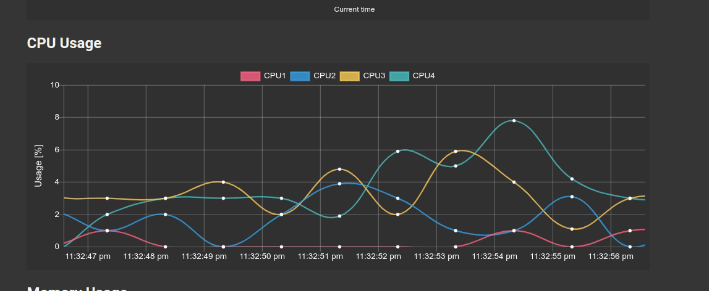

.. raspi-statmon documentation master file, created by
   sphinx-quickstart on Thu Jun  3 10:14:58 2021.
   You can adapt this file completely to your liking, but it should at least
   contain the root `toctree` directive.

Raspi-StatMon documentation
=========================================

Raspberry pi Status Monitor (StatMon) is simple web application that allow you to monitor statistic data such as CPU temperature and Usage of Raspberry pi on the graph.
You can also add a graph to monitor the data obtained from the external sensor connected to the raspi.

.. toctree::
   :maxdepth: 2
   :caption: Table of Contents:

   installation
   start
   usermodel
   logplot
   colortheme
   appendix
   CHANGELOG

Indices and tables
==================

* :ref:`genindex`
* :ref:`modindex`
* :ref:`search`
