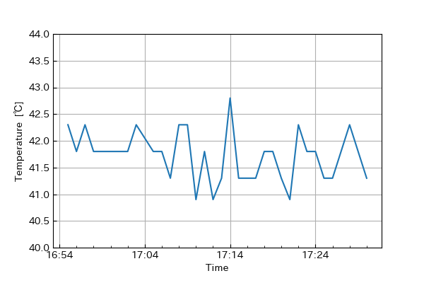

# Log

The StatMon stores the obtained data in log files. This chapter describes the contents of the log shortly.


## Data store
The obtained data are written to csv and stored as data log. The csv is stored to `stat_data` directory in the `data`. The dirctory contains sub-directory whose file name is the data `yyyymm` The log has the file name of `yymmdd.csv` and is stored in the sub-directory.

```bash
data
└-- stat_data
    └-- yyyymm
        └-- yymmdd.csv
```

The csv contains the header in the first line and the data in subsequent lines. so this will be used for other purposes (for example plotting graph with pandas and matplotlib as shown below).

:::{figure-md} fig-target
:class: myclass



Plotting CPU temperature change using matplotlib
:::


## User log
The operations about user account such as login, logout creat and delete accout are written to user log. In the log, The result of process, date, IP address of the PC accessing the machine, the detaild message are shown according to the following format.
```
[<log_level> <date>] <ip_address> : <message>
```
The example are shown as below.
```python
pi@raspberrypi:~/raspi_statmon/raspi_statmon/data $ cat log/202106/20210603.log 
[ERROR 2021-06-33 01:42:01:637] 127.0.0.1 : login failed
[ERROR 2021-06-33 01:42:11:271] 127.0.0.1 : login failed
[ERROR 2021-06-33 01:52:55:301] 127.0.0.1 : login failed
[ERROR 2021-06-33 01:52:58:032] 127.0.0.1 : login failed
[ERROR 2021-06-33 01:53:06:078] 127.0.0.1 : login failed
[ERROR 2021-06-33 01:53:10:546] 127.0.0.1 : login failed
[ERROR 2021-06-33 01:53:15:695] 127.0.0.1 : login failed
[ERROR 2021-06-33 01:53:19:942] 127.0.0.1 : login failed
[SUCCESS 2021-06-33 01:53:31:352] 127.0.0.1 : login success
[SUCCESS 2021-06-33 01:54:00:818] 127.0.0.1 : logout success
[SUCCESS 2021-06-33 01:55:24:899] 127.0.0.1 : logout success
[SUCCESS 2021-06-33 01:55:42:209] 127.0.0.1 : created account
[SUCCESS 2021-06-03 02:26:43:502] 127.0.0.1 : login success
[SUCCESS 2021-06-03 02:49:32:669] 127.0.0.1 : login success
[SUCCESS 2021-06-03 17:02:24:807] 127.0.0.1 : login success
```