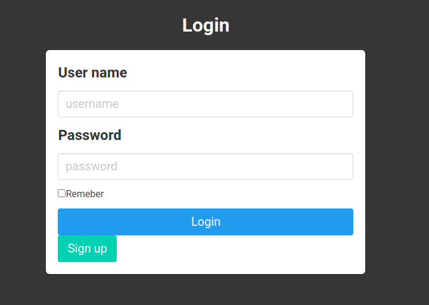

# Getting started

This chapter describes the procedure for monitoring the status of raspberry pi on 
the web browser step by step.


## Directory structure
The directory tree of this project is as follows. `statmon` is root directory, `db_setup.py` and `statmon.py` are the python scripts to be executed by the user. There are other files and sub-directories in the `statmon`

```bash
statmon
└-- db_setup.py
└-- statmon.py
└-- [others]
```


`statmon.py`
: The main script that runs the server by `flask`

`db_setup.py`
: The script for database setup.


## Database setup
At first, you need create the database and table for user account management. The statmon uses `mysql`or `mariadb` to access databases through`flask-SQLAlchemy`. What you have to do at first is that set what user will be used when access to the database. To register the user, exceute `db_setup.py` with "register" ( `-r` )and "password" ( `-p` ) options as follows.
```
python db_setup.py -r [-u <username>] -p <password> 
```

Here is a list of options related to the user registration. Only password option need to be specified. For the other options, the default values are used if not to be specified.

| Option | Description        | Required | Default   |
| ------ | ------------------ | -------- | --------- |
| -u     | User name          | Optional | root      |
| -p     | Password           | Required | -         |
| --port | Port used in mysql | Optional | 3306      |
| -s     | Server             | Optional | localhost |


For example, you want to access database as the root user with password "1234", execute as below.
```
python db_setup.py -r -p 1234 
```
Or sets if you want to use another user "test" and password "foo".
```
python db_setup.py -r -u test -p foo
```
This settings is stored as the json file in the `config/database.json`.


:::{warning}
When creating the database, login as root user with the password. If you have't set up yet, you need setup before this step.
:::


Next, Execute `statmon.py` with `-c` option to create database and table for managing users.
```bash
>> python statmon.py -c
Create 'user' table in database 'raspi'
Create admin user.
```
Executing with this option creates the new database `raspi`, tabel `user` in the database (shown at first line), adds the default user `admin` in the table (shown at second line). You can also add other user from the register page. Since the admin's password is vulnable, adding other user is recommended.


## Start app
To start the application, execute the `statmon.py` in the terminal. Once starting, you can enter to login page in the browser.

```bash
>> python statmon.py 
* Running on http://0.0.0.0:5000/ (Press CTRL+C to quit)
```
In the above case, you can access the page by `http://0.0.0.0:5000/` from the same machine where the app is running (i.e. raspberry pi). In case that access from other PC with the same network, access by `https://[ip_addr]:5000/`, here [ip_addr] is the IP address of the raspberry pi.


## Login & add user
When access to project root page, you are required to login. You can login as the user `admin` with the password of `admin`, but adds other user is recommended for secure. Clicking the sign up button to redirect the sign up page for creating new account. As shown below, The button is shown only when accessing the page from the machine running the app (thus the button is hidden when access from another PC).

:::{figure-md} fig-target
:class: myclass


The button is hidden (when connected from the raspberry pi).
:::

:::{figure-md} fig-target
:class: myclass



The button is displayed (when connected from the raspberry pi).
:::


## Monitoring
As the login produsure is success, you will be redirected to home page. In the top of the page, you see the list of information about hardware running the app (that is raspberry pi). You also see the five graphs showing the current values of getting from raspberry pi. Each graph shows the change in the data below over time.

- CPU temperature
- CPU usage
- Allocated memory
- Frequency
- Load average

The update cycle of the graphs is 1 seconds. The duration displayed on each graph is set to 10 seconds by defalut, which can be changed from the setting page (see below).


## Graph setting
In setting page, you can change the settings of the graphs. To change the current settings, input the value in each box, then click save button to submit the form. If the input values are vaild, a message will appear letting you know that the changes are accepted, then the graphs on the home page will be updated.


| Field | Attribute | Type | Description |
| :-- | :-- | :-- | :-- |
| y-axes | min | int | Minimum of y axis | 
| y-axes | max | int | Maximum of y axis | 
| y-axes | step | int | Step size of tick in y axis | 
| streaming | duration | int | The duration that the data will be displayed on the graph | 
