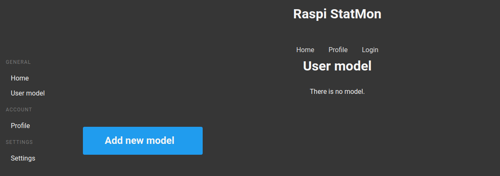
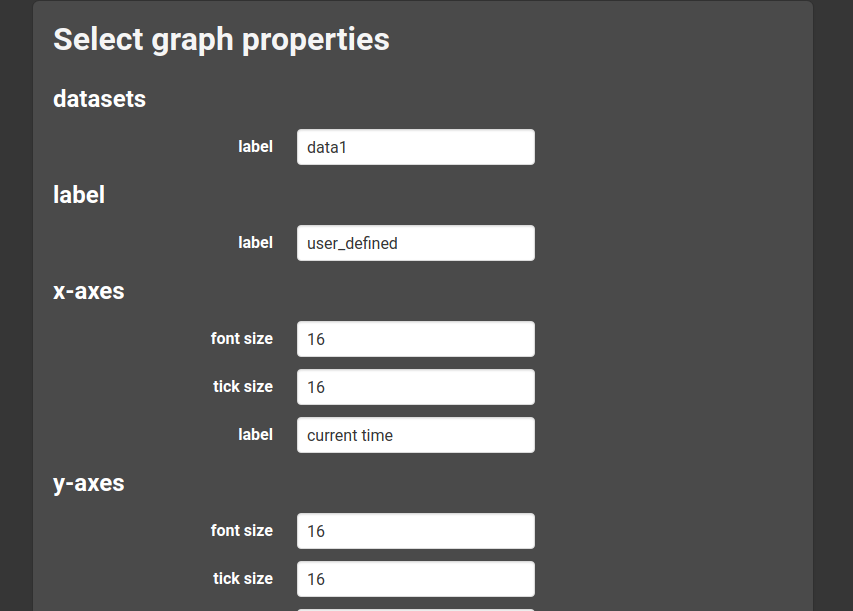

# Add user-defined model

If you want to see the time variation of the another data  such as external temperature sensor, you can add the user-defined graph. In this chapter, we show the steps to add the model.


## Prepare the script
At first, you need to prepare a python script for getting the value to draw on the graph. The script must satisfy these requirements.

- The process to get the value needs to be included in single python script
- The filename of the script has suffix of `.py` 
- The value is output to stdout on single line and no other data should be output.
- The type of the value should be `int` or `float`

Here the simple example is shown. A random value from 0 to 1 is output to stdout every executing.

```python
import random

i = random.random()
print(i)
```

And you should check that the script work as expected.
```
>>> python random_int.py
0.21607009789064113
```

## Register the script.
The next step is to register the script you prepare to the statmon. To do this is simply executeing the script with `-n <script.py>`. The following is the our case.
```
>>> python statmon -n random_int.py
register : random_int.py
```

## Add new model
After registering, you can add the new graph from the user-model page. When log in to statmon and access the user-model page from the navigation on the left, you would see the page as shown below. The message telling there is no model is shown because you haven't add the graph yet.


:::{figure-md} fig-target
:class: myclass



The added model
:::

Clicking the Add tile to add the graph. Select the graph settings you want to add, such as the axis range and scale. The defalut value is set in each box, but you can also set your own choice.

datasets label
: This means the name of label shown on top of the graph

label
: This means the title shown in the user-model page after adding the graph.

streaming refresh
: This means how often the data will be retrieved. The unit is milisecond. Setting this to 1000 corresppnds to get the data at intervals of 1 second.

streaming duration
: This means how long the data will be displayed in the graph. The unit is milisecond. Setting this to 10000 corresppnds to the most recent 10 seconds of data being displayed on the graph.


:::{figure-md} fig-target
:class: myclass



The page of selecting some properties
:::


After setting the value, then click `submit` button to save the values. If all the values are valid, you will be redirected to the results page. The new graph is added and updated in the user-model page.

:::{warning}
After completing the step, you need to restart the server, otherwise the change doesn't reflect the webpage.
:::


:::{figure-md} fig-target
:class: myclass


The newly added graph
:::

If you want to change the model, click `remove the model` to delete the current graph then repeate the above steps. 

:::{warning}
You should restart the server after removing the current model as when add the graph.
:::
